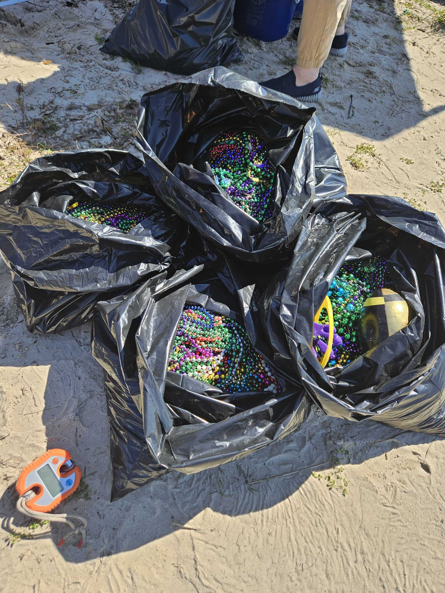

# Python-Experiments
This repository contains the initial code I created when learning to use GitHub as part of DSCI 8133, *Applied Data Science* at Mississippi State University.
---
## Plan
Future plans for this repository include adding a sample data file and a [Jupyter](https:www.jupyter.org) notebook that will interact with the file.
## About Me
I am Evelyn McQueen, Education Specialist for the Mississippi Sound Estuary Program.  
**Data Science** knowledge acquired in this course will help in numerous ways:
- Python Skills
- R Skills
- analyzing complex datasets
In order to test the inclusion of a photograph, I've included this photo of Mardi Gras Beads bound for the landfill, picked up during the Mississippi Coastal Cleanup Mardi Gras Cleanup. 
